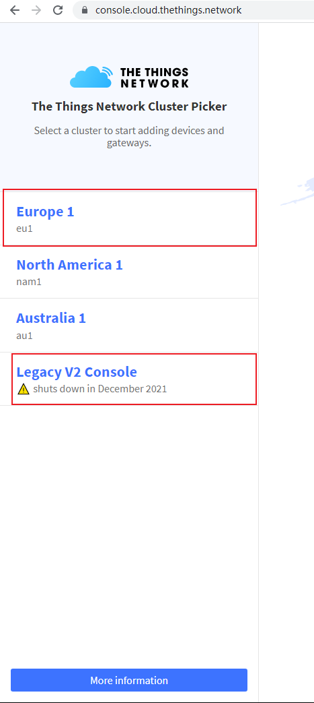
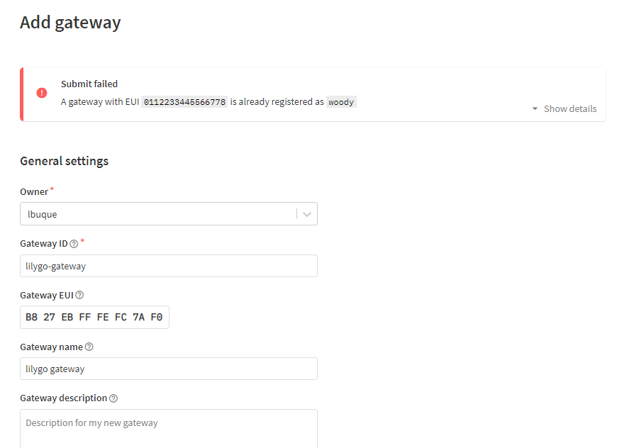
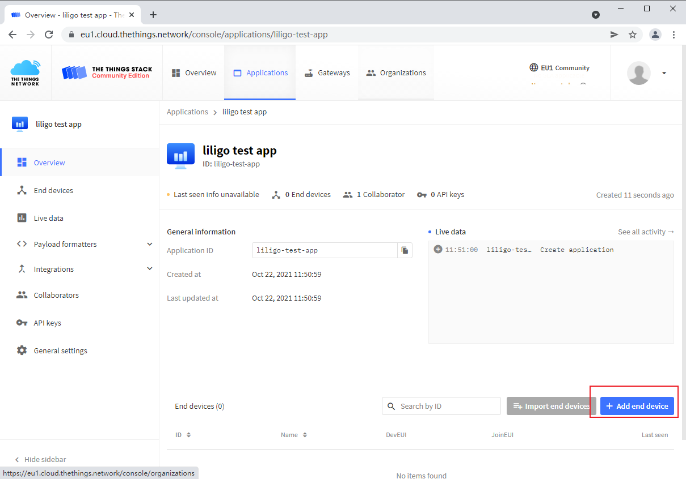
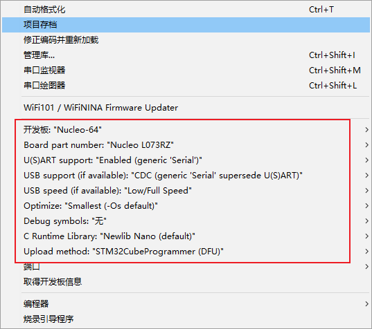
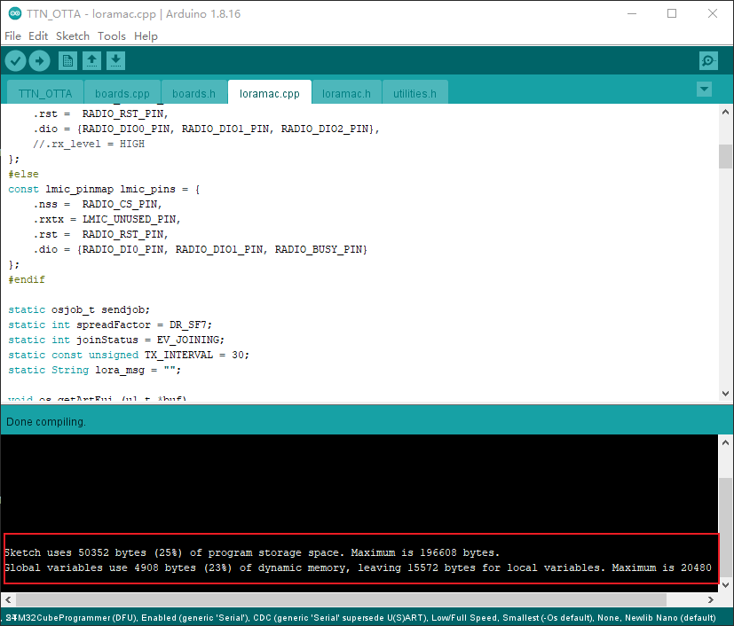

# LilyGo LoRa Series Quick Start On The Things Network

**English | [中文](../zh/LilyGo_LoRa_Series_Quick_Start_On_TTN_zh.md)**

## Index

- [Required](#required)
- [Create a gateway on TTN](#create-a-gateway-on-ttn)
- [Run sx1302_hal on the Raspberry Pi](#run-sx1302_hal-on-the-raspberry-pi)
  - [Enable the SPI interface of the Raspberry Pi](#enable-the-spi-interface-of-the-raspberry-pi)
  - [Download sx1302_hal source code and compile](#download-sx1302_hal-source-code-and-compile)
  - [Configure global_conf](#configure-global_conf)
  - [Run sx1302_hal](#run-sx1302_hal)
  - [Check gateway connection status](#check-gateway-connection-status)
- [Create end device model on TTN](#create-end-device-model-on-ttn)
  - [Enter the create Application page](#enter-the-create-application-page)
  - [Create end device](#create-end-device)
- [LoRaWAN End Device](#lorawan-end-device)
  - [Firmware Compile](#firmware-compile)
  - [Flash Onto The Device](#flash-onto-the-device)
  - [Example Output](#example-output)
- [Q&A](#qa)
  - [LMIC error occurs when building `T-Motion S76G` firmware](#lmic-error-occurs-when-building-t-motion-s76g-firmware)
- [Version History](#version-history)

## Required

> LoRaWAN End Device: T-Motion S76G
>
> LoRaWAN Gateway: Raspberrypi Model 3B + T-SX1302
>
> TTN Version: v3.15.1

## Create a gateway on TTN

1. Log in to https://console.cloud.thethings.network/

2. Select the cluster according to the frequency band supported by the gateway



The frequency band supported by `T-SX1302` is `868MHZ`, here you need to select the `Europe1` cluster

> ! Warning
>
> `Legacy V2 Console` is a server of TTN V2 version, it will be closed in December 2021, it is not recommended to use

3. Create a gateway


4. Configure gateway information

It needs to fill in a unique `Gateway EUI`, if there is no better choice, you can use the MAC address of the Raspberry Pi



5. Select frequency


## Run sx1302_hal on the Raspberry Pi

> NOTE
>
> The LoRaWAN gateway that has been connected to TTN, you can ignore this section

### Enable the SPI interface of the Raspberry Pi


### Download sx1302_hal source code and compile

1. Download source code:

```shell
cd ~
git clone https://github.com/Lora-net/sx1302_hal.git
cd sx1302_hal
git checkout V2.1.0
```

2. Modify the source code

Because `sx1302 hal` cannot read the temperature of `T-SX1302`, some codes in `libloragw/src/loragw_hal.c` need to be commented:

```diff
diff --git a/libloragw/src/loragw_hal.c b/libloragw/src/loragw_hal.c
index ffc8ec0..504bb42 100644
--- a/libloragw/src/loragw_hal.c
+++ b/libloragw/src/loragw_hal.c
@@ -1093,6 +1093,7 @@ int lgw_start(void) {
     dbg_init_random();

     if (CONTEXT_COM_TYPE == LGW_COM_SPI) {
+#if 0
         /* Find the temperature sensor on the known supported ports */
         for (i = 0; i < (int)(sizeof I2C_PORT_TEMP_SENSOR); i++) {
             ts_addr = I2C_PORT_TEMP_SENSOR[i];
@@ -1116,7 +1117,7 @@ int lgw_start(void) {
             printf("ERROR: no temperature sensor found.\n");
             return LGW_HAL_ERROR;
         }
-
+#endif
         /* Configure ADC AD338R for full duplex (CN490 reference design) */
         if (CONTEXT_BOARD.full_duplex == true) {
             err = i2c_linuxdev_open(I2C_DEVICE, I2C_PORT_DAC_AD5338R, &ad_fd);
@@ -1285,14 +1286,14 @@ int lgw_receive(uint8_t max_pkt, struct lgw_pkt_rx_s *pkt_data) {
         nb_pkt_left = nb_pkt_fetched - max_pkt;
         printf("WARNING: not enough space allocated, fetched %d packet(s), %d will be left in RX buffer\n", nb_pkt_fetched, nb_pkt_left);
     }
-
+#if 0
     /* Apply RSSI temperature compensation */
     res = lgw_get_temperature(&current_temperature);
     if (res != LGW_I2C_SUCCESS) {
         printf("ERROR: failed to get current temperature\n");
         return LGW_HAL_ERROR;
     }
-
+#endif
     /* Iterate on the RX buffer to get parsed packets */
     for (nb_pkt_found = 0; nb_pkt_found < ((nb_pkt_fetched <= max_pkt) ? nb_pkt_fetched : max_pkt); nb_pkt_found++) {
         /* Get packet and move to next one */
```

Change the reset pin of `T-SX1302` to `GPIO7`:

```diff
diff --git a/tools/reset_lgw.sh b/tools/reset_lgw.sh
index b58f0e9..56ff943 100755
--- a/tools/reset_lgw.sh
+++ b/tools/reset_lgw.sh
@@ -12,7 +12,7 @@
 # GPIO mapping has to be adapted with HW
 #

-SX1302_RESET_PIN=23     # SX1302 reset
+SX1302_RESET_PIN=7      # SX1302 reset
 SX1302_POWER_EN_PIN=18  # SX1302 power enable
 SX1261_RESET_PIN=22     # SX1261 reset (LBT / Spectral Scan)
 AD5338R_RESET_PIN=13    # AD5338R reset (full-duplex CN490 reference design)
@@ -90,4 +90,4 @@ case "$1" in
     ;;
 esac
```

3. compile

```shell
make clean all
make install
make install_conf
```

### Configure global_conf

```shell
cd ~/sx1302_hal/bin
touch global_conf.json.sx1250.T-SX1302
```

Add the following content to `global_conf.json.sx1250.T-SX1302` :

```json
{
    "SX130x_conf": {
        "com_type": "SPI",
        "com_path": "/dev/spidev0.0",
        "lorawan_public": true,
        "clksrc": 0,
        "antenna_gain": 0, /* antenna gain, in dBi */
        "full_duplex": false,
        "precision_timestamp": {
            "enable": false,
            "max_ts_metrics": 255,
            "nb_symbols": 1
        },
        "radio_0": {
            "enable": true,
            "type": "SX1250",
            "freq": 867500000,
            "rssi_offset": -215.4,
            "rssi_tcomp": {
                "coeff_a": 0,
                "coeff_b": 0,
                "coeff_c": 20.41,
                "coeff_d": 2162.56,
                "coeff_e": 0
            },
            "tx_enable": true,
            "tx_freq_min": 863000000,
            "tx_freq_max": 870000000,
            "tx_gain_lut": [
                {
                    "rf_power": 12,
                    "pa_gain": 0,
                    "pwr_idx": 15
                },
                {
                    "rf_power": 13,
                    "pa_gain": 0,
                    "pwr_idx": 16
                },
                {
                    "rf_power": 14,
                    "pa_gain": 0,
                    "pwr_idx": 17
                },
                {
                    "rf_power": 15,
                    "pa_gain": 0,
                    "pwr_idx": 19
                },
                {
                    "rf_power": 16,
                    "pa_gain": 0,
                    "pwr_idx": 20
                },
                {
                    "rf_power": 17,
                    "pa_gain": 0,
                    "pwr_idx": 22
                },
                {
                    "rf_power": 18,
                    "pa_gain": 1,
                    "pwr_idx": 1
                },
                {
                    "rf_power": 19,
                    "pa_gain": 1,
                    "pwr_idx": 2
                },
                {
                    "rf_power": 20,
                    "pa_gain": 1,
                    "pwr_idx": 3
                },
                {
                    "rf_power": 21,
                    "pa_gain": 1,
                    "pwr_idx": 4
                },
                {
                    "rf_power": 22,
                    "pa_gain": 1,
                    "pwr_idx": 5
                },
                {
                    "rf_power": 23,
                    "pa_gain": 1,
                    "pwr_idx": 6
                },
                {
                    "rf_power": 24,
                    "pa_gain": 1,
                    "pwr_idx": 7
                },
                {
                    "rf_power": 25,
                    "pa_gain": 1,
                    "pwr_idx": 9
                },
                {
                    "rf_power": 26,
                    "pa_gain": 1,
                    "pwr_idx": 11
                },
                {
                    "rf_power": 27,
                    "pa_gain": 1,
                    "pwr_idx": 14
                }
            ]
        },
        "radio_1": {
            "enable": true,
            "type": "SX1250",
            "freq": 868500000,
            "rssi_offset": -215.4,
            "rssi_tcomp": {
                "coeff_a": 0,
                "coeff_b": 0,
                "coeff_c": 20.41,
                "coeff_d": 2162.56,
                "coeff_e": 0
            },
            "tx_enable": true
        },
        "chan_multiSF_0": {
            "enable": true,
            "radio": 1,
            "if": -400000
        },
        "chan_multiSF_1": {
            "enable": true,
            "radio": 1,
            "if": -200000
        },
        "chan_multiSF_2": {
            "enable": true,
            "radio": 1,
            "if": 0
        },
        "chan_multiSF_3": {
            "enable": true,
            "radio": 0,
            "if": -400000
        },
        "chan_multiSF_4": {
            "enable": true,
            "radio": 0,
            "if": -200000
        },
        "chan_multiSF_5": {
            "enable": true,
            "radio": 0,
            "if": 0
        },
        "chan_multiSF_6": {
            "enable": true,
            "radio": 0,
            "if": 200000
        },
        "chan_multiSF_7": {
            "enable": true,
            "radio": 0,
            "if": 400000
        },
        "chan_Lora_std": {
            "enable": true,
            "radio": 1,
            "if": -200000,
            "bandwidth": 250000,
            "spread_factor": 7,
            "implicit_hdr": false,
            "implicit_payload_length": 17,
            "implicit_crc_en": false,
            "implicit_coderate": 1
        },
        "chan_FSK": {
            "enable": true,
            "radio": 1,
            "if": 300000,
            "bandwidth": 125000,
            "datarate": 50000
        }
    },
    "gateway_conf": {
        "gateway_ID": "b827ebFFFEfc7af0",
        /* change with default server address/ports */
        "server_address": "eu1.cloud.thethings.network",
        "serv_port_up": 1700,
        "serv_port_down": 1700,
        /* adjust the following parameters for your network */
        "keepalive_interval": 10,
        "stat_interval": 30,
        "push_timeout_ms": 100,
        /* forward only valid packets */
        "forward_crc_valid": true,
        "forward_crc_error": false,
        "forward_crc_disabled": false,
        /* GPS configuration */
        //"gps_tty_path": "/dev/ttyS0",
        /* GPS reference coordinates */
        // "ref_latitude": 0.0,
        //"ref_longitude": 0.0,
        //"ref_altitude": 0,
        /* Beaconing parameters */
        "beacon_period": 0,
        "beacon_freq_hz": 869525000,
        "beacon_datarate": 9,
        "beacon_bw_hz": 125000,
        "beacon_power": 14,
        "beacon_infodesc": 0
    },
    "debug_conf": {
        "ref_payload": [
            {
                "id": "0xCAFE1234"
            },
            {
                "id": "0xCAFE2345"
            }
        ],
        "log_file": "loragw_hal.log"
    }
}
```

Among them, `gateway_ID` is modified to `b827ebFFFEfc7af0`

`server_address` is changed to `eu1.cloud.thethings.network`

These information should be consistent with the Gateway information created on `TTN`


> NOTE
>
> `serv_port_up` and `serv_port_down` are `1700`

### Run sx1302_hal

```shell
cd ~/sx1302_hal/bin
./lora_pkt_fwd -c global_conf.json.sx1250.T-SX1302
```

### Check gateway connection status

Check if the gateway is successfully connected on TTN


## Create end device model on TTN

### Enter the create Application page


### Create end device

Create a lorawan device, use OTAA to access the network by default




>  NOTE
>
> `DevEUI`, `AppEUI`, `AppKey` can be selected to generate

## LoRaWAN End Device

### Firmware Compile

1. Download Example code

```shell
git clone https://github.com/Xinyuan-LilyGO/LilyGo-LoRa-Series.git
```

2. Create Arduino project

Go to the `LilyGo-LoRa-Series\examples\TTN\TTN_OTTA` directory and modify the `TTN_OTTA.cpp` file to `TTN_OTTA.ino`

Open `TTN_OTTA.ino` and configure the project as follows:



3. Modify board information

Make the following changes to `utilities.h·`:

```diff
diff --git a/examples/TTN/TTN_OTTA/utilities.h b/examples/TTN/TTN_OTTA/utilities.h
index 2874773..9b8aade 100644
--- a/examples/TTN/TTN_OTTA/utilities.h
+++ b/examples/TTN/TTN_OTTA/utilities.h
@@ -7,7 +7,7 @@
 // #define LILYGO_T3_V1_0
 // #define LILYGO_T3_V1_6
 // #define LILYGO_T3_V2_0
-// #define LILYGO_T_MOTION_S76G
+#define LILYGO_T_MOTION_S76G

 // #define LILYGO_T_MOTION_S78G         //Not support
 /*
@@ -171,12 +171,3 @@
 #else
 #error "Please select the version you purchased in utilities.h"
 #endif
```

4. Modify LoRaWAN network access information

Fill the `DevEUI`, `AppEUI`, `AppKey` generated on TTN into the `loramac.cpp` file according to the corresponding byte order:


Compiled successfully:



### Flash Onto The Device

1. Insert `T-Motion S76G` into the USB port of the PC

2. Press and hold the `BOOT` button, then press the `RESET` button, and click the `upload` button in the Arduino IDE

3. The firmware is successfully burned as follows

   

4. Reconnect `T-Motion S76G` to the USB port of the PC

### Example Output

Use the serial port debugging tool, select the `DTR` check box, plug the `T-Motion S76G` into the USB interface of the PC and quickly open the serial port, you can see the debugging information output


On TTN, you can see that the data in the `MAC payload` field is consistent with the data sent in `loramac.cpp`


## Q&A

### LMIC error occurs when building `T-Motion S76G` firmware

The following problems occur because of the incompatibility of the LMIC library version:

```log
loramac.cpp:25:1: error: 'const lmic_pinmap' has no non-static data member named 'rx_level'
   25 | };
      | ^
exit status 1
'const lmic_pinmap' has no non-static data member named 'rx_level'
```

Make the following modifications to the `loramac.cpp` file:

```diff
diff --git a/examples/TTN/TTN_OTTA/loramac.cpp b/examples/TTN/TTN_OTTA/loramac.cpp
index 896be89..6b39f54 100644
--- a/examples/TTN/TTN_OTTA/loramac.cpp
+++ b/examples/TTN/TTN_OTTA/loramac.cpp
@@ -21,7 +21,7 @@ const lmic_pinmap lmic_pins = {
     .rxtx = RADIO_SWITCH_PIN,
     .rst =  RADIO_RST_PIN,
     .dio = {RADIO_DIO0_PIN, RADIO_DIO1_PIN, RADIO_DIO2_PIN},
-    .rx_level = HIGH
+    //.rx_level = HIGH
 };
 #else
 const lmic_pinmap lmic_pins = {
@@ -217,5 +217,3 @@ void loopLMIC(void)
 {
     os_runloop_once();
 }
```

## Version History

| Version | Major changes   | Date       | Author  |
| ------- | --------------- | ---------- | ------- |
| 1.0.0   | Initial release | 2021/10/22 | liangyy |
