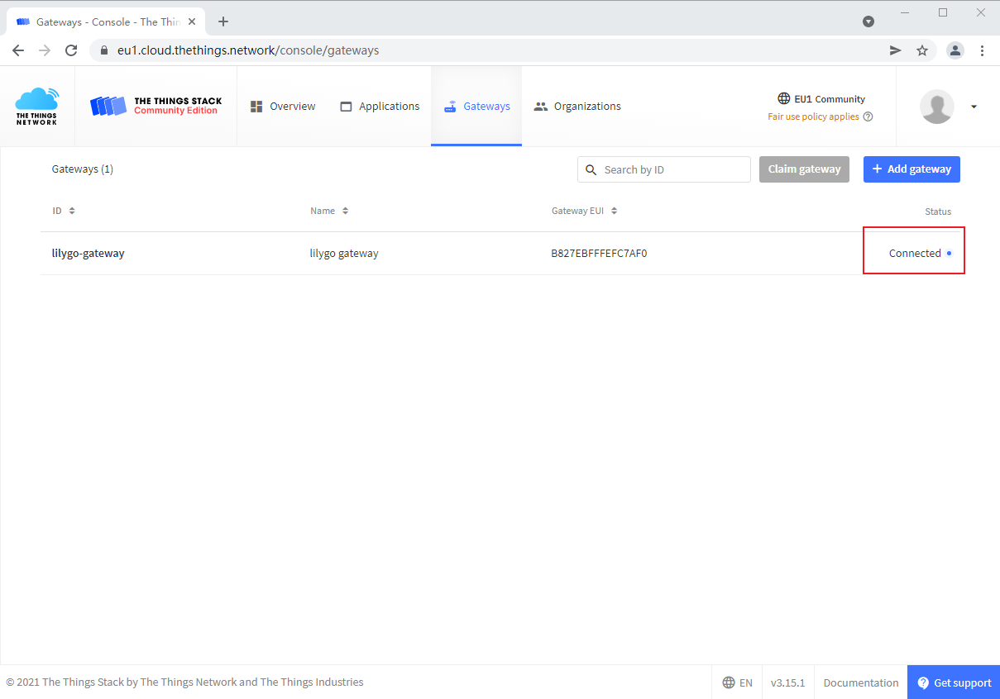
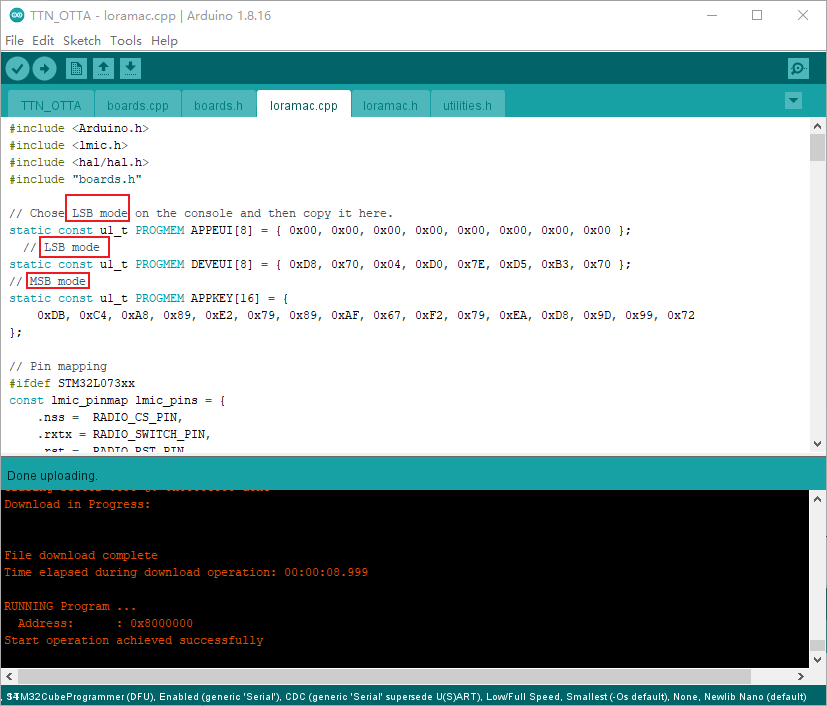
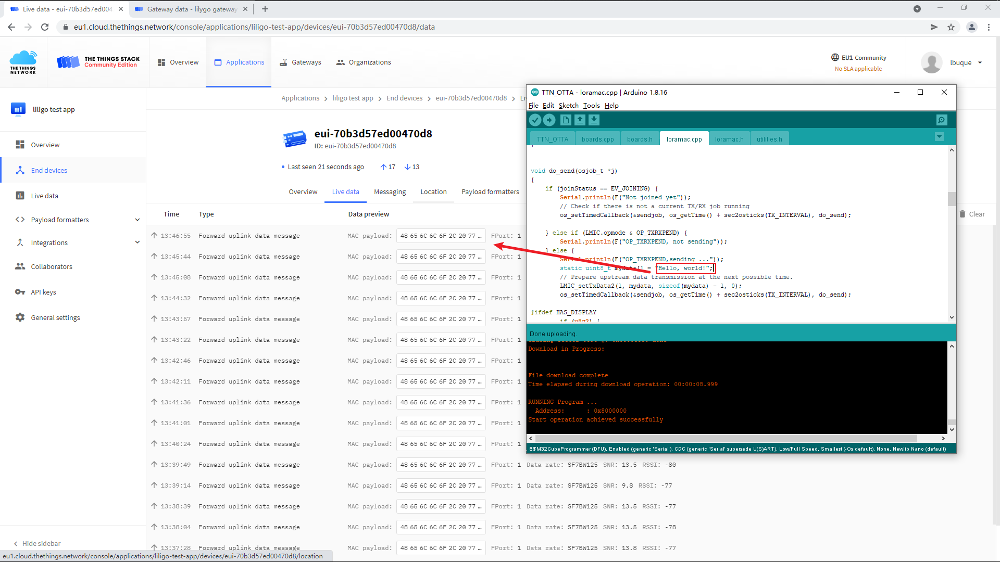

# LilyGo LoRa Series Quick Start On The Things Network

**[English](../en/LilyGo_LoRa_Series_Quick_Start_On_TTN.md) | 中文**

## 目录

- [测试环境](#测试环境)
- [在树莓派上运行sx1302_hal](#在树莓派上运行sx1302_hal)
  - [部署sx1302_hal](#部署sx1302_hal)
  - [获取相关信息](#获取相关信息)
- [在TTN上创建网关](#在TTN上创建网关)
- [检查网关连接状态](#检查网关连接状态)
- [在TTN上创建终端设备模型](#在ttn上创建终端设备模型)
  - [进入创建APP页面](#进入创建app页面)
  - [创建终端设备模型](#创建终端设备模型)
- [LoRaWAN终端设备](#lorawan终端设备)
  - [固件编译](#固件编译)
  - [固件下载](#固件下载)
  - [调试信息输出](#调试信息输出)
- [Q&A](#qa)
  - [构建`T-Motion S76G`固件出现LMIC报错](#构建t-motion-s76g固件出现lmic报错)
- [版本历史](#版本历史)

## 测试环境

> LoRaWAN End Device: T-Motion S76G
>
> LoRaWAN Gateway: Raspberrypi Model 3B + T-SX1302
>
> raspios: [raspios_lite_arm64-2022-01-28](https://downloads.raspberrypi.org/raspios_lite_arm64/images/raspios_lite_arm64-2022-01-28/2022-01-28-raspios-bullseye-arm64-lite.zip)
>
> TTN Version: v3.15.1

## 在树莓派上运行sx1302_hal

> NOTE
>
> 已有其他的也接入到TTN的LoRaWAN网关, 可以忽略该小节

### 部署sx1302_hal

在树莓派执行[sx1302_hal.sh](../../tools/sx1302_hal.sh)，自动部署sx1302_hal。

```shell
sudo ./sx1302_hal.sh -f eu868
sudo reboot
```

### 获取相关信息

```shell
pi@raspberrypi:~ $ cat .sx1302_hal/.output
Gateway EUI: B827EBFFFEFC7AF0
Gateway Server address: eu1.cloud.thethings.network
Gateway Server port: 1700
```

## 在TTN上创建网关

1. 登录到 https://console.cloud.thethings.network/

2. 根据网关支持频段选择对应的集群，`T-SX1302`对应的频段为 `868MHZ`, 这里需要选择 `Europe1` 集群

    

    > ! Warning
    >
    > 其中 `Legacy V2 Console`为TTN V2版本的服务器, 它将在2021年12月份关闭, 不建议使用

3. 创建一个网关

    

4. 配置网关信息

    填入部署sx1302_hal后获得的 [Gateway EUI](#获取相关信息)

    

5. 选择频率，需要部署 sx1302_hal 的频段参数保持一致

    

## 检查网关连接状态

在TTN上检查网关是否连接成功



## 在TTN上创建终端设备模型

### 进入创建APP页面


### 创建终端设备模型

创建终端设备模型, 使用OTAA方式进行入网


> NOTE
>
> `DevEUI`、`AppEUI`、`AppKey`选择自动生成即可

## LoRaWAN终端设备

### 固件编译

1. 下载示例代码

```shell
git clone https://github.com/Xinyuan-LilyGO/LilyGo-LoRa-Series.git
```

2. 创建Arduino工程

进入 `LilyGo-LoRa-Series\examples\TTN\TTN_OTTA` 目录, 将 `TTN_OTTA.cpp` 文件修改为 `TTN_OTTA.ino`

打开 `TTN_OTTA.ino`, 项目配置如下:


3. 修改板卡信息

并对 `utilities.h` 进行以下修改

```diff
diff --git a/examples/TTN/TTN_OTTA/utilities.h b/examples/TTN/TTN_OTTA/utilities.h
index 2874773..9b8aade 100644
--- a/examples/TTN/TTN_OTTA/utilities.h
+++ b/examples/TTN/TTN_OTTA/utilities.h
@@ -7,7 +7,7 @@
 // #define LILYGO_T3_V1_0
 // #define LILYGO_T3_V1_6
 // #define LILYGO_T3_V2_0
-// #define LILYGO_T_MOTION_S76G
+#define LILYGO_T_MOTION_S76G

 // #define LILYGO_T_MOTION_S78G         //Not support
 /*
@@ -171,12 +171,3 @@
 #else
 #error "Please select the version you purchased in utilities.h"
 #endif
```

4. 修改LoRaWAN入网信息

将在TTN上生成的 `DevEUI`、`AppEUI`、`AppKey` 安装对应的字节序填入 `loramac.cpp` 文件中




编译成功如下:


### 固件下载

1. 将`T-Motion S76G`插到PC的USB接口

2. 按住`BOOT`按键，然后按下`RESET`按键, 在 Arduino IDE 中点击 `upload`按钮

3. 烧录固件成功如下

   

4. 重新将`T-Motion S76G`插到PC的USB接口

### 调试信息输出

使用串口调试工具, 选择`DTR`勾选框, `T-Motion S76G` 插到PC的USB接口后迅速打开串口, 即可看到调试信息输出


在TTN上，能看到 `MAC payload` 字段的数据和 `loramac.cpp` 里面发送的数据是一致的



## Q&A

### 构建`T-Motion S76G`固件出现LMIC报错

出现以下问题, 是因为 LMIC 库版本不兼容的问题

```log
loramac.cpp:25:1: error: 'const lmic_pinmap' has no non-static data member named 'rx_level'
   25 | };
      | ^
exit status 1
'const lmic_pinmap' has no non-static data member named 'rx_level'
```

对 `loramac.cpp` 文件进行以下修改即可

```diff
diff --git a/examples/TTN/TTN_OTTA/loramac.cpp b/examples/TTN/TTN_OTTA/loramac.cpp
index 896be89..6b39f54 100644
--- a/examples/TTN/TTN_OTTA/loramac.cpp
+++ b/examples/TTN/TTN_OTTA/loramac.cpp
@@ -21,7 +21,7 @@ const lmic_pinmap lmic_pins = {
     .rxtx = RADIO_SWITCH_PIN,
     .rst =  RADIO_RST_PIN,
     .dio = {RADIO_DIO0_PIN, RADIO_DIO1_PIN, RADIO_DIO2_PIN},
-    .rx_level = HIGH
+    //.rx_level = HIGH
 };
 #else
 const lmic_pinmap lmic_pins = {
@@ -217,5 +217,3 @@ void loopLMIC(void)
 {
     os_runloop_once();
 }
```

## 版本历史

| 版本  | 主要改动 | 日期       | 作者    |
| ----- | -------- | ---------- | ------- |
| 1.0.0 | 初始版本 | 2021/10/22 | liangyy |
| 1.1.0 |         | 2022/11/29 | liangyy |
